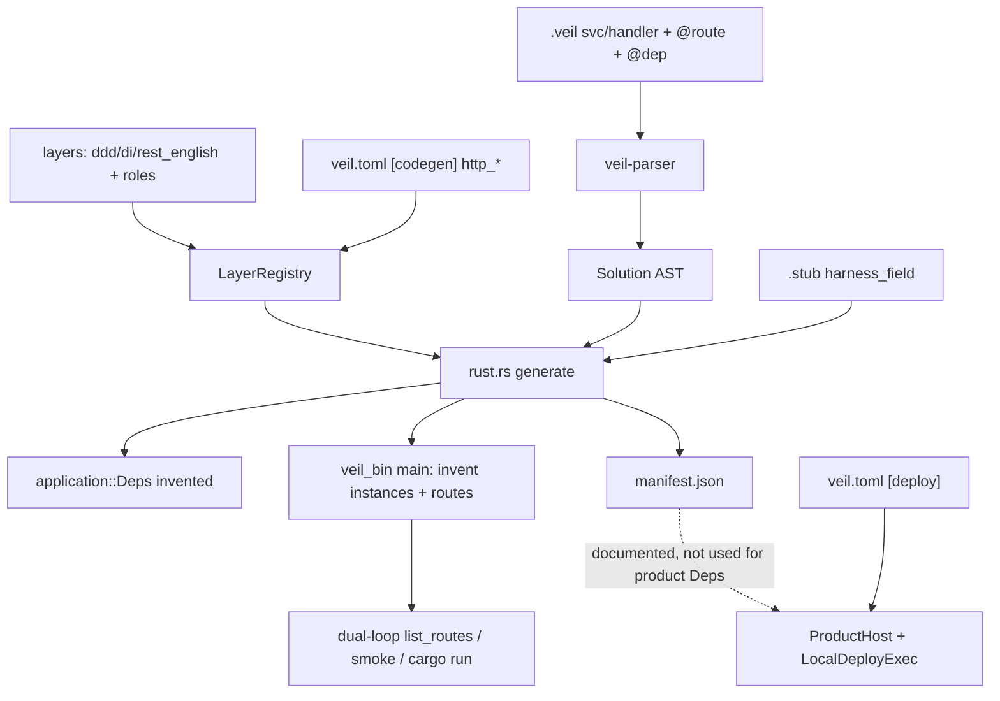
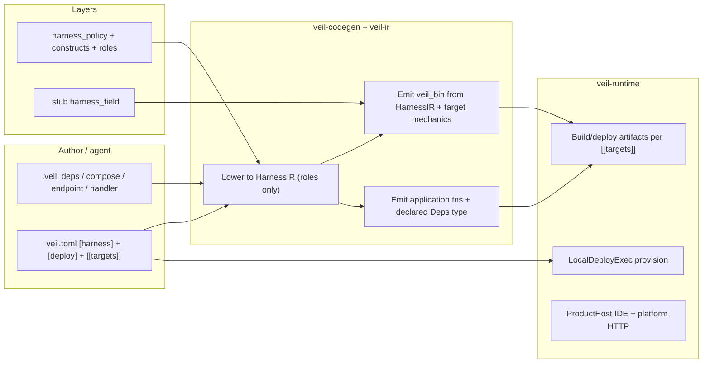
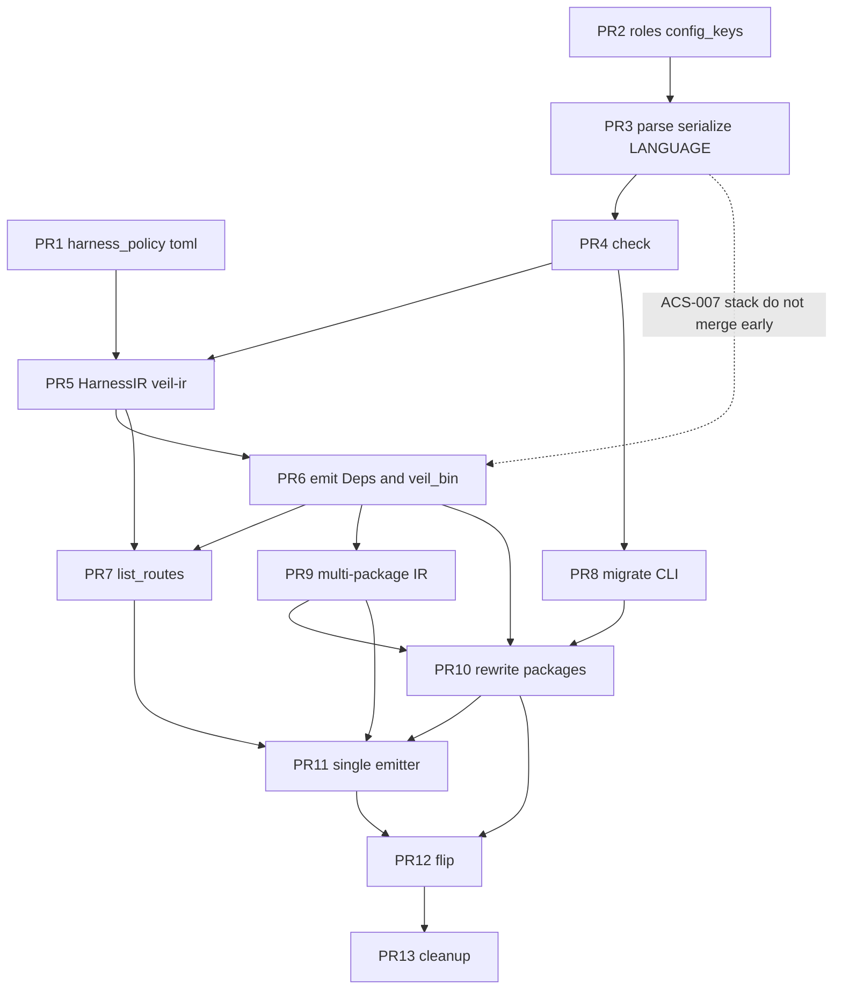

# Configurable Harness + Explicit Endpoints

| Field | Value |
|-------|--------|
| **Title** | Configurable Harness + Explicit Endpoints (Remove Codegen DI Invention and `@route`) |
| **Author** | VEIL engine / runtime architecture |
| **Date** | 2026-08-13 |
| **Status** | Draft |
| **Audience** | Engine, layer, and runtime implementers |
| **Supersedes (behavior)** | Implicit `application::Deps` invention, first-adapter-wins wiring, Bus auto-inject, `@route` + `http_name_policy` name-derived REST in `veil_bin` |

---

## Overview

The local HTTP **customer-app** harness is **not** ProductHost and is **not** `LocalDeployExec`. It is **Rust codegen** in `crates/veil-codegen/src/rust.rs`: `generate()` emits `crates/veil_bin` for *any* package that has a module-shaped construct (`ctx`), then `gen_local_harness_main` / `generate_multi_package_harness` **invent** a `Deps { … }` value, instantiate adapters (first-wins), auto-wire `InProcessBus`, and register axum routes from `@route` (`role:http_route`) or English name derivation (`http_name_policy`, including a `POST /api/{snake}` fallback for every fn). That is the wrong place to decide **customer** application structure.

**ProductHost is a separate story.** Handwritten bootstrap (`runtime/bootstrap/src/platform_http.rs`, `local_ports.rs`) **does** construct generated `storage::application::Deps`, `change_management::application::Deps`, and `deploy::application::Deps` and mounts those services on the IDE host. That injector is allowed (not VEIL-generated). This design must **keep those type names compiling** (`pub struct Deps` and/or `pub type Deps = StorageDeps`) and must **not** dual-host the same APIs from a generated `veil_bin`.

This design keeps **runtime** responsible for **infrastructure provision** (`veil.toml` `[deploy]`, `LocalDeployExec`) and **build/deploy**. It makes the **customer harness** (process composition, dependency construction, handler registration, listen/CORS/auth) a **declared configuration**: reusable profiles live in **layers**; project knobs live in **`veil.toml` `[harness]`**. Authors declare three first-class constructs — `deps`, `compose`, `endpoint` — defined in layers with **construct roles**. API `@route` and name-derived REST leave the engine after a bit-compatible `compat=auto` window. Dual-loop continues, reading **declared** (or compat-synthesized) endpoints.

---

## Background & Motivation

### Where the invention actually lives

Palace and older docs (`docs/ARCHITECTURE.md` “What veil-runtime Does With It”, `docs/HARNESS.md` host-mode table) still say the **runtime reads `manifest.json` and constructs `Deps`**. That is **stale**. Verified against code (2026-08-13):

| Component | What it actually does today |
|-----------|-----------------------------|
| `veil-codegen` `rust.rs` `generate()` | If `!modules.is_empty()`, always emit `veil_bin` (`L130–146`). Ignores whether the author wrote a composition root. |
| `gen_local_harness_main` | Instantiates wired adapters from `@field` / `@env` + stub `harness_field`; builds `{crate}_Deps { … }`; auto-wires routing traits to `InProcessBus`; registers axum routes. |
| `gen_application` | **Invents** `pub struct Deps` by scanning `@dep` inputs + port calls (`collect_deps_field_map`). |
| `generate_multi_package_harness` | Same invention across `[dev].packages`. |
| `gen_manifest` | Writes `manifest.json` (`deps`, `handlers`, `provided_by: "runtime"`). Comment claims “the runtime reads this to construct Deps.” **Customer** `veil_bin` does not read it. |
| ProductHost / `platform_http.rs` / `local_ports.rs` | IDE kernel + **handwritten injector** for the *runtime product*: builds `storage\|change_management\|deploy::application::Deps` and calls generated application fns. Does **not** invent *customer-app* Deps (that is `gen_local_harness_main`). |
| `runtime.veil` `LocalDeployExec` | Plan/provision AWS from `[deploy]`. Bootstrap still **instantiates** it into `deploy::application::Deps`. |

So the user’s “runtime automatically builds the dependency struct” is **correct as a complaint about customer `veil_bin`**, **wrong as a crate name**. Customer-app fix is **codegen + layers + veil.toml**. The runtime product’s handwritten injector stays and must remain source-compatible with generated `application::Deps`. We must not rip provision/build/deploy out of runtime.

### Pain points

1. **Silent structure.** Any `ctx` gets a binary. Authors cannot opt out. Library-only contexts still get an HTTP server (`rust.rs` `L133–136`).
2. **Invented `Deps` shape.** Field names prefer first `@dep` input name; body-scanned ports fall back to `to_snake(Trait)`. Two handlers using different input names for the same port, or a port used only in a body, produce a type the author never wrote.
3. **Invented injection.** First adapter in source order wins; unused adapters are skipped; Bus is injected with no adapter; missing ports become `compile_error!` in *generated* Rust, not `veil check`.
4. **Magic HTTP surface.** `@route("GET /api/…")` is an annotation on `svc`/`handler`. If any `role:http_route` exists, only those are hosted; otherwise **every** fn-shaped construct is routed (`http_routable_services`). `derive_rest_route` **always** returns a route: English prefix if it matches, else `POST /api/{snake-name}`. Collision rewrite prefixes `/api/{crate}/…` without author consent. `list_rest_routes_from_solution` further filters to `ApplicationService`/`DomainService` — a second, already-divergent semantics.
5. **Hardcoded hosting policy in `rust.rs`.** DELETE extras → query, GET filters → query, CORS outside API-key, `VEIL_DEV` default-deny, `veil_json_public` secret redaction, DomainError → 404/400/502. Some of this is legitimate **target mechanics**; some is **product policy** that should be a layer profile.
6. **Template DSL cannot replace this today.** `di.layer` can emit `@main` fragments and `@dep` constructors. It cannot emit adapter instantiation, stub recipes, or axum routers. So the engine grew a second, unofficial composition language inside `rust.rs`.
7. **INV-001 drift.** Engine avoids the string `"route"` (uses `role:http_route`) but still encodes REST English, adapter-field heuristics (`client`, `DATABASE` → `pool`), and `keyword == "handler"` / `"svc"` residuals.

### Current data flow (today)



---

## Goals & Non-Goals

### Goals

1. **Stop inventing `Deps` shape and injection.** The application (or a layer template the application `use`s) **declares** the bundle type and the wire map. Codegen **executes** that declaration.
2. **Make the harness configurable.** Composition style, listen, CORS, auth, health, bin name, path prefix, and adapter overrides come from **layer `harness_policy` + `veil.toml` `[harness]`**, not from `rust.rs` constants.
3. **Remove `@route` on API services/handlers.** HTTP endpoints become a **first-class construct** (`endpoint`) declared in a layer, with explicit method, path, handler binding, and input mapping.
4. **Remove name-derived REST as an engine behavior.** `http_name_policy` no longer creates routes. Routing styles (REST vs RPC) affect **how declared endpoints are hosted**, not **which paths exist**.
5. **Keep dual-loop.** `list_routes`, `read_generated(what=harness)`, smoke `gen + cargo check`, `VEIL_DEV=1` remain. Routes come from declared endpoints (or generated `.route(` lines).
6. **Keep runtime provision + build/deploy intact.** `[deploy]`, `LocalDeployExec`, `[[targets]]` gen/output/`dev_command`, S3/DDB source store — unchanged.
7. **Preserve INV-001.** Engine matches **roles / policies / HarnessIR**, never `"route"`, `"endpoint"`, `"dep"` as product spellings in `rust.rs`.
8. **Migration path** for existing `@route` + implicit Deps packages (compat shim + mechanical rewrite + staged default flip).

### Non-Goals

- Rewriting ProductHost HTTP **routes** or the IDE kernel. Bootstrap Deps **constructors** (`platform_http.rs`, `local_ports.rs`) stay handwritten; they must keep compiling via a `pub type Deps = …` alias (or unchanged `pub struct Deps` name) — see §4.1. Updating those files is allowed only if the alias is not enough, and then **in the same PR wave** as any rename (PR 10).
- Removing `@dep` / `@pvd` / `@main` as **usage** annotations (`role:dependency` / `provider` / `main` stay). Handlers still mark injected ports with `@dep`.
- Removing UI page `@route` on `svelte5` `page` / `layout` (those annotations have **no** `role:http_route`; they are a different surface).
- Replacing `.stub` `harness_field` recipes (they remain the SDK construction source).
- A full generic DI container / service locator at runtime.
- Forcing every project to hand-write axum. A **shipped** `harness` + `axum_http` layer is the default profile.
- Changing `[deploy]` resource provisioning or Lambda/API GW topology.
- Making `manifest.json` the local composition root (it stays a **compiler → deployer** description, not an injector).
- Expanding the template DSL to a Turing-complete harness language in v1 (see Alternatives).

---

## Proposed Design

### 1. Responsibility split (normative)



| Layer | Owns | Must not own |
|-------|------|----------------|
| **Layers** | Constructs (`deps`, `compose`, `endpoint`), construct **roles**, `harness_policy` defaults, reusable hosting styles (`axum_http`, `axum_rpc`), prompts | AWS, DDB table names, ProductHost |
| **`veil.toml`** | Project overrides: profile, listen, cors, auth, prefix, wire map, compat mode; **`[deploy]`** infra; **`[[targets]]`** build | Application types, handler bodies |
| **Codegen (`rust.rs` + `veil-ir/src/harness.rs`)** | Lower declared IR → `HarnessIR`; emit axum/tokio/serde **mechanics**; apply stub recipes **when compose cites them** | Inventing Deps fields; picking adapters; deriving REST from names; parsing `"route"`; hard-coding product paths (`/api/providers`) |
| **Runtime** | Provision from `[deploy]`; compile/upload; ProductHost | Inventing **customer-app** Deps or routes. **May** keep the existing handwritten injector for *its own* generated crates. |

`docs/ARCHITECTURE.md` § “What veil-runtime Does With It” (steps 1–3: “reads deps → constructs adapters”) must be rewritten: customer `cargo run -p veil_bin` is **generated composition**; ProductHost’s handwritten constructors are a **runtime-product** exception, not a generic host injector for customer apps.

### 2. HarnessIR — the only input to `veil_bin` emission

**Placement (mandatory):** `crates/veil-ir/src/harness.rs` so `veil check`, `list_routes`, and codegen share one structure. Codegen only **emits** from that IR (`crates/veil-codegen/src/emit_harness.rs`).

```rust
/// Lowered, role-driven harness. No product annotation names.
#[derive(Debug, Clone)]
pub struct HarnessIR {
    pub profile: String,              // axum_http | axum_rpc | product_host
    pub bin_name: String,             // default "veil_bin"
    pub listen: ListenSpec,           // see unified knobs §3.2 / §5.3
    pub health_path: Option<String>,  // Some("/health") or None
    pub cors: CorsMode,               // localhost | env | permissive | none
    pub cors_outside_auth: bool,      // orthogonal layering flag; axum_http = true
    pub auth: AuthMode,               // none | api_key
    pub path_prefix: Option<String>,  // prepended to relative endpoint paths
    pub collide: CollideMode,         // error | prefix_crate
    pub emit_bin: EmitBinMode,        // on_entry | never
    pub compat: CompatMode,           // auto | off
    pub contexts: Vec<HarnessContext>,
}

pub struct HarnessContext {
    pub crate_name: String,
    pub deps: Option<DepsDecl>,       // None → .with_state(())
    pub compose: Option<ComposeDecl>,
    pub endpoints: Vec<EndpointDecl>,
    /// v1 + compat: every fn-shaped construct when a routing trait is on the bundle
    /// (today’s gen_local_harness_main L776–780). Do not drop HTTP handlers from the bus.
    pub bus_handlers: Vec<BusHandlerDecl>,
}

pub struct DepsDecl {
    pub type_name: String,            // e.g. CatalogDeps
    pub fields: Vec<DepsField>,       // name + trait
}

pub struct ComposeDecl {
    pub name: String,
    pub bundle: String,               // DepsDecl.type_name
    pub wires: Vec<WireDecl>,         // field → adapter | provided_runtime | expr
}

pub struct WireDecl {
    pub field: String,
    pub kind: WireKind,
}

pub enum WireKind {
    Adapter { name: String },         // construct with shape Impl targeting the trait
    /// Layer-declared runtime-provider ident (shipped spelling `provided_runtime`,
    /// role `runtime_provider` on the compose wire vocabulary — not a rust.rs literal).
    ProvidedRuntime,
    StubField { type_name: String },  // use stub harness_field recipe as the value
}

pub struct EndpointDecl {
    pub name: String,
    pub method: String,               // GET/POST/… — HTTP protocol, not product vocab
    pub path: String,                 // after prefix apply
    pub handler: String,              // application fn construct name
    pub binds: Vec<BindDecl>,         // input name → path|query|header|body
}

pub struct BindDecl {
    pub input: String,
    pub source: BindSource,           // Path / Query / Header(name) / Body / TenantHeader
}
```

**Lowering rules (INV-001):**

- Collect constructs where `registry.construct_has_role(c, "deps_bundle")`.
- Collect `role:compose`.
- Collect `role:http_endpoint`.
- Merge `registry.harness_policy` with `veil.toml` `[harness]` (toml wins).
- Do **not** scan all fns for routes.
- Do **not** invent Deps fields from `@dep`.
- Do **not** pick “first adapter”.
- Bus / Auth appear in `ComposeDecl` only when a `wire` uses a `role:runtime_provider` ident **or** names a concrete adapter. In `compat=auto`, missing routing-trait / auth-trait wires are **synthesized** as `ProvidedRuntime` (today’s auto-inject).
- Bus **registration** (v1 + compat): if any routing trait is on the bundle, register **every fn-shaped construct** in the context (same as today). Tightening is a post-flip follow-up with `harness_bus_unregistered`, not a silent drop.

`emit_harness_bin(ir: &HarnessIR, …)` is the only emitter after the single-emitter PR. Multi-package merge is `HarnessIR` concatenation + prefix collision **diagnostic**, not silent `/api/{crate}/` rewrite (override via `[harness] collide = "prefix_crate" | "error"`, default `error` in compat=off, `prefix_crate` in compat=auto). Multi-package **must** use single-package auth + `cors=localhost` (do **not** adopt today’s multi-package `CorsLayer::permissive()` / missing API-key middleware).

### 3. Layer surface — reusable harness

#### 3.1 Construct roles (new, INV-001)

Today roles exist only on **annotations** (`AnnotationSpec.roles`). Add optional roles on `ConstructSpec`:

```text
# crates/veil-ir LayerRegistry
pub fn construct_has_role(&self, c: &Construct, role: &str) -> bool
pub fn constructs_with_role<'a>(&'a self, sol: &'a Solution, role: &str) -> Vec<&'a Construct>
```

Layer syntax (extend construct header, same `role:` token already used on `ann` lines):

```text
construct HttpEndpoint
  kw endpoint
  mt struct
  role http_endpoint
  ...
```

Engine never matches keyword `"endpoint"`. Products may rename `kw http` as long as `role http_endpoint` remains.

#### 3.2 `harness_policy` block (new, same merge style as `http_name_policy`)

Layer, toml, and IR share **one enum per knob** (same token strings):

```text
# layers/harness.layer (or layers/axum_http.layer)
harness_policy
  profile axum_http          # axum_http | axum_rpc | product_host
  bin veil_bin
  listen_env PORT
  listen_default 3000
  health /health             # or none
  cors localhost             # localhost | env | permissive | none
  cors_outside_auth true     # orthogonal to cors mode
  auth api_key               # none | api_key
  emit_bin on_entry          # on_entry | never  — not "always_if_modules"
  bus_wire explicit          # explicit | synthesize_runtime (compat uses synthesize)
  collide error              # error | prefix_crate
  bind_defaults method       # method | none
  delete_extras query        # query | body | error
  # Traits that compose may wire as provided_runtime (INV-001 — no "Bus" string in rust.rs).
  # Also any trait construct tagged role:runtime_provider, plus routing_traits()
  # and auth_policy.service_trait (those layers mark them).
  provided_runtime_trait Bus
  provided_runtime_trait AuthService
```

Parse in `veil-ir/src/layer.rs` next to `parse_http_name_policy`. Merge: later `use` wins; `veil.toml` `[harness]` applied last via `LayerRegistry::apply_harness_overrides`. See the merge table in §5.3.

`cors_outside_auth` is **not** a cors origin mode. It means “CORS Tower layer wraps API-key (OPTIONS preflight not blocked).” `axum_http` sets it `true`.

#### 3.3 Shipped constructs (`layers/harness.layer`)

`ddd.layer` **`use harness` after the flip** (PR 12; not in PR 1). Typical DDD apps then get `endpoint` / `deps` / `compose` vocabulary from `use ddd` alone. Opt-out: `[harness] emit_bin = "never"`. Until the flip, packages `use harness` explicitly (already common: `examples/local_run.veil`).

```text
construct DepsBundle
  kw deps
  mt struct
  role deps_bundle
  in Context
  group application
  desc "Declared application dependency bundle — the Deps type"

construct ComposeRoot
  kw compose
  mt struct
  role compose
  in Context
  group infrastructure
  has
    bundle: ident
    wire: struct
  desc "Composition root: which adapter satisfies each deps field"

construct HttpEndpoint
  kw endpoint
  mt struct
  role http_endpoint
  in Context
  group presentation
  has
    method: ident
    path: path
    handle: Construct<Fn>
    bind: struct
  desc "Explicit HTTP endpoint — engineer-defined method/path/handler/binds"

# Compose wire vocabulary — INV-001: engine matches role, not the spelling.
# Shipped ident is `provided_runtime`; a product layer may rename it.
construct RuntimeProviderWire
  kw provided_runtime
  mt struct
  role runtime_provider
  desc "Wire kind: satisfy this deps field from the generated local runtime impl"
```

Layer loader must parse `role foo` (and `role foo, bar`) on construct bodies in PR 2 (`Section::None` today only knows `kw`/`mt`/`desc`/`in`/`group`/`tgt`/`dg`/`au`). `has method: ident` feeds `ConstructSpec.config_keys` / `step_fields` so the parser and the viewer palette know which field names are config.

`di.layer` keeps `@dep` / `@pvd` / `@main`. `@main` remains a **contributor** to `fn main` (CLI demos, ProductHost). It is **not** the HTTP router inventor.

#### 3.4 Authoring syntax (v1: existing field + named-block grammar)

Endpoints and compose are **instances**, but v1 **reuses `name: Type` fields and named blocks** so we do **not** add `Construct.config` or a `method POST` space-separated grammar (Alternative G). `parse_struct_shape` already accepts fields and `has bind: struct` blocks.

```veil
endpoint CreateItemHttp
  method: POST
  path: "/api/items"
  handle: CreateItem
  bind
    name: body

endpoint GetItemHttp
  method: GET
  path: "/api/items/{id}"
  handle: GetItem
  bind
    id: path
    tenant_id: query

deps CatalogDeps
  item_repo: ItemRepo
  notifier: Notifier
  # bus: Bus          # only if the app actually uses Bus

compose CatalogLocal
  bundle: CatalogDeps
  wire
    item_repo: MemItemRepo
    notifier: SmtpNotifier
    # bus: provided_runtime    # ident declared in harness.layer with role:runtime_provider
```

**How this parses today + one localized extension:**

| Line | Existing grammar | Lowering |
|------|------------------|----------|
| `method: POST` | field `name=method`, `TypeExpr::Named("POST")` | HTTP verb (protocol token) |
| `handle: CreateItem` | field, `Named("CreateItem")` | handler construct |
| `bundle: CatalogDeps` | field | deps bundle name |
| `name: body` inside `bind` | named-block field | `BindSource` |
| `item_repo: MemItemRepo` inside `wire` | named-block field | `WireKind::Adapter` or `ProvidedRuntime` if the type ident has `role:runtime_provider` |
| `path: "/api/items/{id}"` | **not** a type today | **Required extension:** `parse_type` accepts a string token as **`TypeExpr::LitStr`** (not `Named`). `serialize.rs` `type_to_veil` today emits `Named(n)` **unquoted**; stuffing a path into `Named("/api/items")` serializes to `path: /api/items`, which does **not** parse back. `LitStr` must emit `path: "/api/items/{id}"`. |

`ConstructSpec.config_keys` (from `has method: ident` / `path: path` / `handle: Construct<Fn>`) tells check which fields are required on `role:http_endpoint` / `role:compose` **and** which field types are **protocol tokens**, not domain types (see §3.5 exemptions). Viewer palette uses the same `has` / `FieldMeta` (no extra IDE schema).

**Required in the same landing as the parser (ACS-007):** `TypeExpr::LitStr` in AST; `parse_type` + `serialize.rs` `type_to_veil` quote `LitStr`; **compact header parse** (§3.4.1); parse→serialize→parse fixture **must include a braced path and a compact header**; `docs/LANGUAGE.md`.

**Rejected:** `method POST` / `path /api/items` config-member lines (space-separated keys without `:`). They do not parse in `parse_struct_shape` (L1859–2016). Compact **header** sugar is a different, specified form (§3.4.1).

#### 3.4.1 Compact header (v1 sugar — same ACS-007 stack)

First-class **parse** form alongside field syntax. Desugars to the same `method` / `path` / `handle` fields. Field syntax stays.

**Grammar:**

```text
endpoint <Name> <METHOD> <path> -> <Handler>
  bind                        # optional named block
    <input>: <source>
```

- `<METHOD>` is an HTTP verb token (`GET`/`POST`/`PUT`/`PATCH`/`DELETE`/`HEAD`/`OPTIONS`), case-insensitive.
- `<path>` starts with `/`. Brace params `{id}` only. Not quoted in the compact form (parser takes the token sequence until `->`).
- `-> <Handler>` names the fn-shaped construct (same as `handle:`).
- Optional indented `bind` block is identical to field-form `bind`.
- Invalid if both a compact header **and** `method:` / `path:` / `handle:` fields are present (`harness_endpoint_dup_spec`).

**Examples:**

```veil
endpoint CreateItemHttp POST /api/items -> CreateItem
  bind
    name: body

endpoint GetItemHttp GET /api/items/{id} -> GetItem
  bind
    id: path
    tenant_id: query
```

Equivalent field form (and **canonical serialize**):

```veil
endpoint CreateItemHttp
  method: POST
  path: "/api/items"
  handle: CreateItem
  bind
    name: body
```

**Round-trip:** `serialize.rs` **always emits field form** (`write_source` stability). Parser accepts compact **or** field. Dual-loop edit → serialize → parse must not flip-flop: compact input serializes to fields; re-parse of fields stays fields.

**ACS-007:** parser + serialize + LANGUAGE.md + check + emit of compact headers land in PR 3–6. Do not ship parse-only sugar.

**HTTP verbs** as `Named("POST")` etc. are protocol tokens (`GET`/`POST`/`PUT`/`PATCH`/`DELETE`/`HEAD`/`OPTIONS`). Matching them in the lowerer is allowed (`docs/POLICY_ROLES.md`).

#### 3.5 Typecheck (`veil-ir` `check.rs` / `typecheck.rs` / new `harness_check.rs`)

All of these are **errors** when `harness.compat = "off"`; **warnings** that record synthesized IR when `compat = "auto"`:

| Code | Rule |
|------|------|
| `harness_endpoint_unknown_handler` | `handle` must name a fn-shaped construct in the same solution (`svc` / `handler` / `fn`). |
| `harness_endpoint_bad_method` | method not in HTTP verb set. |
| `harness_endpoint_bad_path` | path must start with `/` or be relative (no scheme). Brace params `{id}` only. |
| `harness_bind_unknown_input` | bind name must match a non-dependency input of the handler. |
| `harness_bind_missing` | every non-`@dep` handler input must have a bind (or a default bind policy from the **profile**, see §5). |
| `harness_bind_unused_path_param` | `{id}` in path must appear as `bind id: path`. |
| `harness_deps_unknown_trait` | deps field type must be a trait-shaped construct (port/repo) or a layer-declared trait. |
| `harness_compose_unknown_bundle` | `bundle` must name a `role:deps_bundle` construct in the same context. |
| `harness_compose_missing_field` | every deps field must have a wire. |
| `harness_compose_unknown_adapter` | wire target must be an adapter for that field’s trait, **or** `provided_runtime` when the **deps field’s trait** is in the provided-runtime set (§4.2). |
| `harness_provided_runtime_not_marked` | `wire field: provided_runtime` but the deps field’s trait is not runtime-provided (no `role:runtime_provider`, not in `harness_policy.provided_runtime_trait`, not `routing_traits()`, not `auth_policy.service_trait`). |
| `harness_endpoint_dup_spec` | Compact header **and** `method:`/`path:`/`handle:` fields on the same construct. |
| `harness_multiple_deps` | More than one `role:deps_bundle` in a context (v1: one bundle per context). |
| `harness_implicit_route_dropped` | **Not used in compat=auto** (see § Data Model — we keep POST fallback). After flip, leftover name-only services with no `endpoint` error as this or `harness_route_annotation_removed`. |
| `harness_compose_adapter_trait_mismatch` | `adapter X for Y` but field type is not `Y` (or alias). |
| `harness_profile_unknown` | `[harness].profile` not declared by any loaded layer. |
| `harness_emit_bin_without_compose` | `emit_bin = on_entry` and package has authored endpoints but no compose (compat=off). |
| `harness_duplicate_route` | two endpoints share (method, path) after prefix; `collide = error`. |
| `harness_route_annotation_removed` | `@` annotation with `role:http_route` present after deprecation flip (error). During compat: warning + synthesize endpoint. |

Incomplete wiring is a **check** failure, not a generated `compile_error!`. Keep `compile_error!` only as a last-resort invariant if IR was skipped (should be unreachable).

**Field-syntax exemptions (normative — ACS-007 stack).** `endpoint` / `compose` / `deps` are `mt struct`. Their config fields (`method: POST`, `path: LitStr`, `bind name: body`, `wire bus: provided_runtime`) are **not** domain types. Three pipelines must skip them or customer packages fail `veil check` / emit junk Rust:

1. **`names.rs`:** do **not** call `check_type_expr` on fields whose name is in the construct spec’s `config_keys`, nor on fields inside `bind` / `wire` named blocks. HTTP verbs, bind sources (`path`/`query`/`body`/`header`/`tenant`), and `role:runtime_provider` idents are protocol tokens. `provided_runtime` is a **keyword** (`RuntimeProviderWire`); the name index is by construct **name**, so it would otherwise be `unresolved_type` (same as `unknown_type_on_field_errors`). `handle: CreateItem` / `bundle: CatalogDeps` / `deps` port types / `wire` adapter names **are** still resolved (they name real constructs).
2. **`serialize.rs`:** `TypeExpr::LitStr` emits quoted strings. Fixture: `path: "/api/items/{id}"` round-trips (braces + slashes).
3. **Codegen (`flatten_module` / `gen_types`):** **skip** constructs with `role:http_endpoint`, `role:compose`, or `role:deps_bundle`. They must not land in `contents.structs` or emit `pub struct CreateItemHttp { method: POST, … }` / a second domain `CatalogDeps`. Only `gen_application` emits the deps struct from `DepsDecl`.

These three bullets are required in PR 4 (1–2 as check/serialize tests) and PR 6 (3).

### 4. Who owns Deps, who instantiates adapters

#### 4.1 The type

**Owner:** the `deps` construct in the context (application group).

Codegen (`gen_application`) emits **exactly**:

```rust
/// Declared by `deps CatalogDeps` (or `deps Deps` / `deps StorageDeps`).
pub struct CatalogDeps {
    pub item_repo: std::sync::Arc<dyn ItemRepo + Send + Sync>,
    pub notifier: std::sync::Arc<dyn Notifier + Send + Sync>,
}

/// Compatibility alias — required for one full release after any rename.
/// Handwritten ProductHost (`platform_http.rs`, `local_ports.rs`) constructs
/// `storage::application::Deps` / `change_management::application::Deps` /
/// `deploy::application::Deps`. Do not delete this until bootstrap is updated
/// in the same PR, or never rename those three crates off `Deps`.
pub type Deps = CatalogDeps;
```

**v1 rule for generated type name:**

- If the author writes `deps Deps`, emit `pub struct Deps` only (no alias needed).
- If the author writes `deps StorageDeps` (or any other name), emit `pub struct StorageDeps` **and** `pub type Deps = StorageDeps`.
- Runtime product packages (`storage`, `change_management`, `deploy`, `extensions`, …) should keep the construct name `Deps` so bootstrap needs **zero** edits unless we choose to rename later.

If a context has no `deps` construct: **do not emit** `application::Deps` (stateless `.with_state(())`). **Exception:** `compat=auto` synthesis still emits `pub struct Deps` with today’s `collect_deps_field_map` shape.

`expr.rs` `gen_deps_struct` (today hard-codes `pub struct Deps` + snake(trait) fields) must take `DepsDecl` or be deleted in the emit PR — no second emitter.

If a context has multiple `deps` constructs: error `harness_multiple_deps`. **v1: one bundle per context.** Do not add per-handler named bundles unless a real context later needs two graphs.

Handler signature rule (unchanged idea, declared type):

- `@dep` inputs are **not** HTTP inputs; they are satisfied from the bundle by **field name**.
- Typecheck: each `@dep` type must equal some `deps` field type; the `@dep` **input name** should match the deps **field name** (error on mismatch — this is the bug first-wins was papering over).

```veil
handler CreateItem
  input
    name: Str
    @dep item_repo: ItemRepo    # must match CatalogDeps.item_repo
```

Emitted:

```rust
pub async fn create_item(deps: &CatalogDeps, name: String) -> Result<Uuid, DomainError>
```

**Do not** scan handler bodies to add extra Deps fields. If a body calls a port not on the bundle, typecheck `unknown_port` / existing unresolved external.

#### 4.2 Instantiation

**Owner:** the `compose` construct (+ stub `harness_field` when an adapter has `role:adapter_field`).

Emission sketch for `compose CatalogLocal`:

```rust
let _stub_client = /* stub harness_field Client, only if a wired adapter needs it */;
let mem_item_repo_inst: Arc<dyn catalog::ports::ItemRepo + Send + Sync> =
    Arc::new(catalog::adapters::MemItemRepo {});
let smtp_notifier_inst: Arc<dyn catalog::ports::Notifier + Send + Sync> =
    Arc::new(catalog::adapters::SmtpNotifier { /* @field / @env */ });
let catalog_deps = Arc::new(catalog::application::CatalogDeps {
    item_repo: mem_item_repo_inst,
    notifier: smtp_notifier_inst,
});
```

Rules:

- Only adapters **named in `wire`** are constructed.
- `@field` still wins over `@env` for the same adapter field (existing).
- Stub recipes apply only to wired adapters that reference that type.
- `wire <field>: provided_runtime` is valid when the **deps field’s trait** is in the **provided-runtime set** (not only Bus/Auth). The wire ident is layer-declared (`role:runtime_provider` on `kw provided_runtime`). Engine matches roles / policy lists — **never** the strings `"Bus"` / `"AuthService"`.
- **Provided-runtime set** (union):
  1. Trait constructs tagged `role:runtime_provider`
  2. Names listed in `harness_policy` `provided_runtime_trait <Name>`
  3. `registry.routing_traits()` (layers already mark routing ports)
  4. `auth_policy.service_trait` when set (`auth_local` marks AuthService)
- Emission: shared `InProcessBus` when the trait is a routing trait; `AllowAllAuth`-style impl from the **declared trait surface** when it is the auth policy trait; other marked traits get the same generated local impl pattern (trait surface only — no hard-coded method names). If no impl can be generated, `harness_provided_runtime_no_impl`.
- `ddd` / `auth_local` / `harness` mark Bus and AuthService so today’s wires keep working. A product layer may mark **any** trait (e.g. `FileSystem`) the same way.
- `veil.toml [harness.wire]` can override adapter names per project (same env, different adapter) without editing `.veil`.

```toml
[harness.wire]
# context-qualified or unique field name
item_repo = "DynamoItemRepo"
```

Toml override must still typecheck against the port.

#### 4.3 `@main` vs `compose`

| Mechanism | Role after this design |
|-----------|------------------------|
| `compose` | Declared wiring for the HTTP/bin harness. Required to emit adapter instances into `veil_bin`. |
| `@main` | Extra steps in `fn main` after compose (demo invoke). **Still emits `veil_bin`** when present (CLI / `di_example.veil`), even with no `ctx`. `di.layer` `emit_to "main"` stays. |
| No compose, no `@main`, no template main, no `link veil_server`, no endpoints | **Library package.** No `veil_bin`. This deletes **only** `generate()` `\|\| !modules.is_empty()`. |
| Endpoints, no compose | Check error (compat=off) or synthesize compose (compat=auto). |
| `link veil_server` | **Until flip:** implies `profile=product_host` and emits `gen_product_host_main` (today’s `wants_product_host`). **After flip:** `runtime/src/host.veil` + `runtime/veil.toml` must set `profile = "product_host"` (or the host layer’s `harness_policy`). |

ProductHost is **not** a rename-only of `link veil_server` until those files actually declare the profile. Test: `host.veil` gen still emits ProductHost listen when `link veil_server` is present and `[harness] profile` is absent (pre-flip).

### 5. Hosting declared endpoints (not inventing them)

The harness **hosts** `EndpointDecl`s. It does not create them.

#### 5.1 Bind + extractors (profile defaults)

`axum_http` profile (shipped) applies **only to missing binds** when `compat=auto`. When `compat=off`, binds are required.

Default bind policy if a profile is allowed to fill gaps:

| HTTP method | Path `{param}` matching input | Remaining inputs |
|-------------|-------------------------------|------------------|
| GET, DELETE, HEAD | `path` | `query` |
| POST, PUT, PATCH | `path` | `body` |
| any | input named `tenant_id` | `tenant` (X-Tenant-Id, existing helper) |

This policy lives in **`harness_policy` / profile**, not as English REST in `derive_rest_route`. Profiles may set `bind_defaults = none` (`axum_rpc` / strict).

Generated handler (target mechanics — stays in engine):

```rust
async fn catalog_create_item_handler(
    State(deps): State<Arc<catalog::application::CatalogDeps>>,
    Json(body): Json<Value>,
) -> Result<Json<Value>, StatusCode> {
    let name = /* body extract */;
    match catalog_app::create_item(&deps, name).await {
        Ok(result) => Ok(Json(veil_json_public(&result))),
        Err(e) => Err(veil_domain_error_status(e)),
    }
}
```

Keep as **target mechanics** (documented in POLICY_ROLES “acceptable engine knowledge”):

- axum `Router`, `MethodRouter`, extractors
- `veil_json_public` for `role:secret` (not product-specific)
- `veil_domain_error_status` matching **`DomainError` variants** (existing contract)
- CORS Tower layer **outside** auth when `cors_outside_auth = true`; OPTIONS skips key
- Auth when `auth = api_key`: same env mechanics as today (`veil_api_key_middleware`) — see Security

Move **into profile/toml**:

- Whether to emit `/health`
- CORS **origin mode** (`localhost` default — **not** `permissive`)
- Auth mode (`api_key` vs `none`)
- Path prefix
- Whether DELETE uses query. Profile `delete_extras = query` (axum_http) vs `body` vs `error`

**Product paths (INV-001, v1 = ProductHost only):** today’s generic middleware hard-codes `/api/providers` (admin-only) and `/api/integrations` + `/api/execute` (tenant-scoped). Those are **product policy**. They must **not** ship in the generic `axum_http` emitter. **v1 keeps any remaining enforcement only in ProductHost handwritten middleware** (`platform_http.rs`). Do **not** add a layer allow-list in this design — extra scope; runtime packages use `emit_bin=never`, so ProductHost is the only consumer. A layer allow-list is a later follow-up if a customer `veil_bin` ever needs the same rules. Multi-package IR (PR 9) must not copy these paths into every app.

#### 5.2 Routing styles (layers, not name derivation)

| Layer | Effect on **declared** endpoints |
|-------|----------------------------------|
| `axum_http` (new, default via `harness`) | Host each endpoint at its method+path; JSON/query extractors; CORS+auth as policy. |
| `axum_rpc` (new; replaces `rest_rpc` purpose) | Still requires explicit `endpoint`. May default `method POST` only if the author omitted method **and** compat allows. Does **not** invent paths from handler names. |
| `rest_english` | **Deprecate** as a route inventor. Keep as a **prompt pack** (“prefer GET /api/{plural}”) and optional **migration helper** that *proposes* endpoint text. After flip, `http_name_policy` is unused by codegen. |
| `rest_rpc` | Today: clear prefixes so name-derive is off and `@route` is required. After flip: no-op or alias to `axum_rpc`. |

`ddd.layer` / `rust.layer` drop `use rest_english` for **codegen effect** in the deprecation PR. Prompts can still recommend REST shapes.

#### 5.3 `veil.toml` `[harness]` (project-specific)

```toml
[harness]
profile = "axum_http"          # axum_http | axum_rpc | product_host
compat = "auto"                # auto | off   (default auto until flip)
# listen: omit → listen_env PORT + listen_default 3000, bind 0.0.0.0
# listen = "0.0.0.0:3000"    # overrides default port/host; PORT env still wins if set
path_prefix = "/api/v1"        # prepended if endpoint path does not already start with it
health = "/health"             # or "none"
cors = "localhost"             # localhost | env | permissive | none  (NOT permissive by default)
cors_outside_auth = true
auth = "api_key"               # none | api_key
collide = "error"              # error | prefix_crate
bin = "veil_bin"
emit_bin = "on_entry"          # on_entry | never

[harness.wire]
item_repo = "PgItemRepo"
```

**Merge table** (layer `harness_policy` → toml `[harness]` → IR). Absent toml key = keep layer; `"none"` / `"-"` / `""` clears optionals (same as `CodegenToml::normalize_opt`).

| Knob | Layer token | Toml key | IR field | Default (`axum_http`) |
|------|-------------|----------|----------|------------------------|
| profile | `profile axum_http` | `profile` | `profile` | `axum_http` |
| bin | `bin veil_bin` | `bin` | `bin_name` | `veil_bin` |
| listen env | `listen_env PORT` | *(part of `listen`)* | `listen.env` | `PORT` |
| listen default | `listen_default 3000` | `listen = "0.0.0.0:3000"` | `listen.host` + `listen.default_port` | `0.0.0.0:3000` |
| health | `health /health` | `health` | `health_path` | `Some("/health")` |
| CORS origins | `cors localhost` | `cors` | `cors` | `localhost` |
| CORS vs auth | `cors_outside_auth true` | `cors_outside_auth` | `cors_outside_auth` | `true` |
| auth | `auth api_key` | `auth` | `auth` | `api_key` |
| emit bin | `emit_bin on_entry` | `emit_bin` | `emit_bin` | `on_entry` |
| collide | `collide error` | `collide` | `collide` | `error` (compat=auto uses `prefix_crate` if unset) |
| compat | *(none)* | `compat` | `compat` | `auto` until flip |
| bind defaults | `bind_defaults method` | `bind_defaults` | *(profile)* | `method` |
| delete extras | `delete_extras query` | `delete_extras` | *(profile)* | `query` |

`cors` values:

| Value | Origins |
|-------|---------|
| `localhost` | Current single-package `veil_cors_layer()`: `CORS_ORIGINS` if set, else `:5173` / `:5174` / `:3000` only |
| `env` | `CORS_ORIGINS` only (fail closed if unset) |
| `permissive` | `*` — **explicit opt-in**, not the default (today’s multi-package is this; we do not keep it) |
| `none` | No CORS layer |

`auth = api_key` env mechanics (not toml keys; stay in the emitter as target mechanics):

- `/health` + OPTIONS always open
- Open **only if** `VEIL_DEV=1` **and** `VEIL_REQUIRE_AUTH` is unset **and** neither `VEIL_API_KEY` nor `VEIL_TENANT_KEYS` is configured
- Else require `X-Api-Key` or `Authorization: Bearer` matching `VEIL_API_KEY` and/or `VEIL_TENANT_KEYS`
- Tenant-scoped binds still prefer `X-Tenant-Id`

Implementation:

- Extend `veil-ir/src/deps.rs` `VeilTomlFile` with `harness: Option<HarnessToml>` using the **same** enum strings.
- **Do not** overload `[codegen] http_*`. Those keys remain until the flip PR, then no-op + `codegen_http_prefix_deprecated`.
- `[codegen]` keeps `bus_strip_prefix` and `auth_service_trait`.
- `[module.*]` stays opaque to runtime. `[harness]` is **codegen** input.

### 6. Remove `@route` (API)

#### 6.1 What is removed

- `ddd.layer` `ann route: … role:http_route` on `DomainService` and `ApplicationService`.
- Engine path: `http_route_annotation`, `has_route_annotation`, `parse_route_annotation`, `http_routable_services` fallback-to-all-fns, `derive_rest_route`.
- Agent prompts that say “prefer `@route("GET /api/…")`” (`harness.layer`, `agent_context.rs`, `docs/HARNESS.md`, palace `veil-contract-routes`, ladder READMEs).

#### 6.2 What is kept

- Svelte `page` / `layout` `@route("/")` in `svelte5.layer` — **no** `role:http_route`; typescript/sveltekit routing. Out of scope. **svelte5 / sveltekit5 must keep matching page routes by page/layout construct role or the annotation name declared in `svelte5.layer`, never `role:http_route`.** Adding `role:http_route` to svelte5 would pull pages into API routing if any scanner later walks all constructs. Known bug (follow-up, not this design): `typescript.rs` `gen_spa_bundle` already looks up `http_route_annotation` for `subkind == "page"` and therefore **never** sees Svelte `@route` (falls back to `/{camelName}`). Fix that helper on the svelte annotation/role — do not “fix” it by tagging pages `http_route`.
- HTTP verb/path **parsing** for endpoint `method` / `path` fields.
- `list_routes` tool (implementation changes, name stays).

#### 6.3 Replacement authoring

**Before:**

```veil
group application
  @route("POST /api/items")
  svc CreateItem
    input
      name: Str
    step persist
      ...
```

**After:**

```veil
group application
  svc CreateItem
    input
      name: Str
      @dep item_repo: ItemRepo
    step persist
      ...

group presentation
  endpoint CreateItemHttp POST /api/items -> CreateItem
    bind
      name: body
  # equivalent field form (canonical serialize):
  # endpoint CreateItemHttp
  #   method: POST
  #   path: "/api/items"
  #   handle: CreateItem
  #   bind
  #     name: body
```

Handlers stay the application/domain logic. Endpoints are the HTTP surface. Thin-handler-to-domain-svc collapse (`bus_policy` strip `HandleGetX` → `GetX`) is **unchanged** and independent of HTTP.

### 7. When is `veil_bin` emitted?

Replace:

```rust
// rust.rs today
let has_main = compose_main_section(...).is_some()
    || package_has_main_annotation(...)
    || !modules.is_empty(); // DELETE THIS LINE ONLY
```

With (`emit_bin == on_entry`, the default):

```text
emit veil_bin iff
  (harness.emit_bin != never
     OR package links veil_server
     OR profile == product_host)
  AND any of:
        HarnessIR has at least one compose
     OR declared endpoints + compose (compat may synthesize compose)
     OR package has role:main                    # @main CLI / di_example / host.veil
     OR di.layer (or any layer) emit_to "main"   # compose_main_section
     OR package links veil_server                # implies profile=product_host until flip
     OR (compat=auto AND synthesized compose from modules)
```

**Delete only** `|| !modules.is_empty()`. Keep standalone `@main`, template mains, and `link veil_server`.

**`emit_bin=never` vs ProductHost (shared `runtime/veil.toml`):** `find_project_root` walks from any `runtime/src/*.veil` to the single `runtime/veil.toml` (today the UI package). Putting `[harness] emit_bin = "never"` there would also apply to `host.veil` (`veil gen runtime/src/host.veil -o runtime/generated-host`), which **must** still emit `crates/veil_bin` (`link veil_server` + `@main`, no modules).

**Rule:** `emit_bin=never` is **ignored** when the package `link`s `veil_server` or `profile=product_host`. Platform packages (`runtime.veil`, CM, …) stay `never` (no customer-style HTTP bin). `host.veil` stays `on_entry` via the link/profile exception. Do **not** require a second `veil.toml` for `generated-host`.

Empty modules / pure domain libraries (no `@main`, no compose, no link) generate crates only.

### 8. Dual-loop

| Tool | After |
|------|--------|
| `list_routes` `source=ir` | `list_endpoints_from_solution` via HarnessIR. **Declared `role:http_endpoint` first**, then compat-synthesized. JSON `via: "endpoint"` \| `"compat_route"` \| `"compat_name"` (the last includes today’s POST fallback). Update server tests that keyed on `"http_route"`/`"name"` in the same change. |
| `list_routes` `source=generated` | Keep scanning `.route("` in `veil_bin`. Add **`patch(`** (and `head` if emitted) to the method detector (`agent_runtime_tools.rs` today only sees get/post/put/delete). |
| Empty IR hint | Replace “add `@route` or List/Get/Create names” with “add `endpoint` (method/path/handle) or run `veil migrate harness`”. Mention `@route` only as compat input until flip, not as the thing to write. |
| `read_generated(what=harness)` | Unchanged path `crates/veil_bin/src/main.rs`. |
| Smoke | Unchanged `veil gen` + `cargo check` (ACS-012 crate scope). Failures still restore. |
| `http_request` | Unchanged; agents must `list_routes` first. |
| `VEIL_DEV=1` | Honored under `auth = api_key` **only** when `VEIL_REQUIRE_AUTH` is unset and no keys are configured (live middleware). |

Update `crates/veil-server/src/agent_context.rs` as soon as declared endpoints exist (list_routes PR): prefer `endpoint`; never invent paths; `list_routes` before `http_request`. Do **not** wait for the flip PR to stop teaching `@route` as the primary authoring form.

### 9. Manifest.json (compiler → deployer only)

Keep emitting `manifest.json` for deployment units (`au`). Change meaning:

```json
{
  "context": "Catalog",
  "crate": "catalog",
  "deps": {
    "item_repo": { "trait": "ItemRepo", "adapter": "MemItemRepo" }
  },
  "endpoints": [
    { "name": "CreateItemHttp", "method": "POST", "path": "/api/items", "handler": "CreateItem" }
  ],
  "handlers": { "CreateItem": { "function": "create_item", "inputs": [...] } },
  "compose": "CatalogLocal"
}
```

- `provided_by: "runtime"` **only** if compose wire is a `role:runtime_provider` ident.
- Runtime **must not** grow a **generic customer-app** Deps injector. The existing handwritten ProductHost constructors stay. Cloud deploy uses manifest for **env lists, unit names, endpoint inventory** (API GW mapping later). Customer local wiring is generated `veil_bin`.
- Update GEN-007 tests accordingly.

### 10. Provision / build / deploy (unchanged)

Do **not** change provision/deploy **behavior**:

- `runtime/src/runtime.veil` `DeployExec` / `LocalDeployExec` product logic
- `runtime/docs/DEPLOY_ENVIRONMENTS.md` `[deploy]` / `[[deploy.units]]`
- `[[targets]]` `package` / `target` / `output` / `dev_command` / `dev_port`
- Dual-loop `[dev].packages` + `veil gen-harness` **CLI** (implementation becomes HarnessIR merge)
- AWS_PROFILE / `VEIL_DDB_TABLE` / `BUCKET` local runtime convention
- Single ProductHost (no dual `veil serve`)

**Runtime product HTTP policy (normative):**

| Package | `emit_bin` | `@route` / `endpoint` | Who hosts `/api/…` |
|---------|------------|------------------------|--------------------|
| `runtime/src/runtime.veil`, `change-management.veil`, storage/CM/deploy contexts | `never` | Convert **or delete** every `role:http_route` in the rewrite PR. Do **not** leave annotations for the flip to error on, and do **not** emit a second `veil_bin` surface. | ProductHost `platform_http.rs` only |
| `runtime/src/host.veil` | `on_entry` | no API `@route` required | `link veil_server` → `gen_product_host_main` |
| Customer examples / fixtures | `on_entry` | migrate to `endpoint` | generated `veil_bin` |

`runtime/veil.toml` **may** set `[harness] emit_bin = "never"` so `runtime.veil` / CM do not grow a customer-style `veil_bin`. That flag **does not** suppress `host.veil`: `link veil_server` / `profile=product_host` overrides `never` (§7). After PR 10, `veil gen runtime/src/host.veil` must still emit `crates/veil_bin`. `dev_command = "VEIL_DEV=1 cargo run -p veil_bin"` remains valid for **customer** targets with `[harness] bin = "veil_bin"`.

---

## API / Interface Changes

### LayerRegistry

```rust
// veil-ir
impl LayerRegistry {
    pub fn construct_has_role(&self, c: &Construct, role: &str) -> bool;
    pub fn is_http_endpoint(&self, c: &Construct) -> bool {
        self.construct_has_role(c, "http_endpoint")
    }
    pub fn apply_harness_overrides(&mut self, o: &HarnessToml);
    pub harness_policy: HarnessPolicy,
}

pub struct HarnessPolicy { /* same tokens as §5.3: profile, bin, listen_*, health, cors, cors_outside_auth, auth, emit_bin, bus_wire, collide, bind_defaults, delete_extras */ }
```

Deprecate (then delete in flip PR): `is_http_route_annotation`, `construct_has_http_route`, `http_route_annotation`, `HttpNamePolicy` **use in codegen**. Keep parse/merge for one release so old layers load.

### Codegen public API

```rust
// veil-ir/src/harness.rs
pub fn lower_harness(sol: &Solution, registry: &LayerRegistry) -> Result<HarnessIR, Vec<Diagnostic>>;

// veil-codegen — thin wrapper
pub fn list_rest_routes_from_solution(...) -> Vec<IrRestRoute>; // via HarnessIR
```

`IrRestRoute.via`: `"endpoint"` | `"compat_route"` | `"compat_name"` (`compat_name` includes the POST fallback).

### CLI

```text
veil check pkg.veil            # new harness_* diagnostics
veil gen …                     # emit from HarnessIR
veil gen-harness A B -o dir    # merge HarnessIRs
veil migrate harness [path]    # new: rewrite @route → endpoint; synthesize deps/compose
```

`veil migrate harness` (must produce **runnable** in-tree examples — `local_run.veil` / `hello_world.veil` have **no** `@dep` today):

1. **Endpoints from today’s router, not from `@route` only.** For each construct `http_routable_services` would host, emit `endpoint {Name}Http` in `group presentation` (create the group if missing):
   - If `role:http_route` is present, use `rest_route_for_service` (same parser as today).
   - Else use `derive_rest_route` **including the POST `/api/{snake}` fallback**.
2. **Rewrite Express `:id` → `{id}`** in copied paths (`fixtures/ladder/l1/crud.veil`, `fixtures/multi_harness/{product,platform}.veil`). `path_param_names` is brace-only.
3. **Seed `deps` from `collect_deps_field_map`** (existing: `@dep` inputs **and** body-scanned port calls). Prefer field names from `@dep`; else `to_snake(Trait)`. Name the construct `Deps` when migrating runtime product crates; `{Ctx}Deps` is fine for examples.
4. **Insert `@dep {field}: {Trait}`** on each handler that uses that port (body or input) and does not already have it. This is what makes §4.1’s “do not scan bodies at check time” true **after** migrate.
5. Infer binds from path braces + method (axum_http default table).
6. Build `compose {Ctx}Local` with one adapter per port (if exactly one; if many, pick none and insert `TODO` + diagnostic). Wire routing/auth traits as `provided_runtime` when the handler/`deps` set includes them.
7. Strip `@route(...)` lines on svc/handler (not svelte page `@route`).
8. Print a report (endpoints added, `:id` rewrites, `@dep` inserted, ambiguous adapters).

Dry-run default; `--write` applies.

### veil.toml schema

New `[harness]` / `[harness.wire]` as above. No change to `[deploy]`, `[module.*]`, `[package]`, `[[targets]]`.

### Agent / docs

- `docs/HARNESS.md`, `docs/POLICY_ROLES.md`, `docs/ARCHITECTURE.md`, `docs/CODEGEN_TEMPLATES.md`, **`docs/LANGUAGE.md`** (ACS-007 user-visible sugar)
- `layers/harness.layer` prompt
- `crates/veil-server/src/agent_context.rs`
- `fixtures/palace_contracts/veil-contract-routes.md` → explicit endpoints
- Ladder READMEs L0–L3

---

## Data Model Changes

### AST (`veil-ir/src/ast.rs`)

**No `Construct.config`.** v1 stores endpoint/compose keys as ordinary `fields` + named `blocks` (`bind`, `wire`). Add **`TypeExpr::LitStr`** for quoted paths; do not store paths as `Named`.

### ConstructSpec (`layer.rs`)

```rust
pub struct ConstructSpec {
    // ...
    /// INV-001 construct roles, e.g. ["http_endpoint"].
    #[serde(default)]
    pub roles: Vec<String>,
    /// Field names that are config (from `has method: ident`, `path: path`, …).
    #[serde(default)]
    pub config_keys: Vec<String>,
}
```

Layer loader: parse `role foo` / `role foo, bar` inside construct body (PR 2). `has` lines populate `config_keys` / `step_fields` / `blocks` as they already do for other constructs.

### No persistence / DDB migration

Compile-time IR only. Generated `application::Deps` **keeps that name** when the construct is `deps Deps`. Other names emit `pub struct {Name}` **plus** `pub type Deps = {Name}` for one full release. Handwritten bootstrap (`storage::application::Deps` etc.) must keep compiling — update `runtime/bootstrap/src/platform_http.rs` and `local_ports.rs` **in the same PR** if the alias is ever dropped.

### Compat synthesized IR (not persisted) — **true bit-compat**

When `compat=auto` and a context has no authored `endpoint`/`deps`/`compose`, synthesize **exactly** what today’s emitters host:

1. **Endpoints = `http_routable_services` + `rest_route_for_service`.**
   - If any `role:http_route` exists in the module, only those constructs (same as today).
   - Else **every fn-shaped construct** in that module (same as today — **not** “English prefix or nothing”).
   - Method/path = `rest_route_for_service` / `derive_rest_route`, including the **unconditional POST `/api/{snake-name}` fallback** (`GreetUser` → `POST /api/greet-user`).
   - `via=compat_route` if from `role:http_route`; `via=compat_name` otherwise (prefix match **or** POST fallback).
   - Do **not** invent a third filter (`is_a ApplicationService` only). `list_routes` source=ir must use this same set so it no longer diverges from the emitter.
2. **Deps:** `collect_deps_field_map` → synthetic type **named `Deps`** (old signatures).
3. **Compose:** first adapter per port (existing) + `ProvidedRuntime` for routing/auth traits if missing.
4. **Bus registration:** every fn-shaped construct when a routing trait is on the bundle (existing L776–780).
5. **Collide:** `prefix_crate` (existing silent rewrite).
6. **CORS/auth:** single-package `localhost` + `api_key` middleware (multi-package compat **gains** this; it does not keep permissive/open).

This **is** bit-compatible with today’s single-package `veil_bin`, including packages with no `@route` and non-English names. It is **intentionally not** bit-compatible with today’s multi-package **open CORS / no API-key** (that is a security bug; PR 9 documents the tightening). They break at the flip unless migrated (`veil migrate harness` emits the same endpoint table as this synthesis).

---

## Alternatives Considered

### A. Keep `@route` as optional sugar

**Idea:** First-class `endpoint` plus `@route` desugars to the same IR.

**Pros:** Smaller migration; agents already know `@route`.  
**Cons:** The whole problem is magic annotations on handlers mixing HTTP with domain. Sugar preserves the worst authoring pattern. INV-001 stays one rename away from `"route"` in prompts forever.  
**Decision:** Reject as **end state**. Allow **only** as compat desugar during migration (`compat=auto`). After flip, `@route` on `svc`/`handler` is a check error. Do not keep dual authoring.

### B. Keep auto-Deps but make it opt-in

**Idea:** `[harness] auto_deps = true` (default true, later false).

**Pros:** Fast toggle; little parser work.  
**Cons:** The invention remains in `rust.rs`; two composition semantics forever; still no explicit adapter choice when two adapters exist.  
**Decision:** Reject as end state. Compat=auto **is** this opt-in, time-boxed, implemented as IR synthesis — not a permanent engine mode.

### C. Put all wiring only in `veil.toml`

**Idea:** No `compose` construct; `[harness.wire]` lists every port.

**Pros:** One file for ops.  
**Cons:** Violates “reusable patterns in layers / project-specific in toml”. Adapter graphs are application structure; they belong in `.veil` next to adapters. Toml cannot typecheck as cleanly against AST without becoming a second language. `[module.*]` is intentionally opaque to runtime; we should not make toml a composition DSL.  
**Decision:** Toml **overrides** only. Default wire map is `compose` in VEIL.

### D. Generate a default `axum_rest` layer vs requiring every project to write a harness

**Idea:** Either ship a complete profile so `use harness` is enough, or make every app write `fn main` in VEIL.

**Pros of shipping a profile:** Matches “do not force every project to write a harness”; dual-loop stays one `use`.  
**Pros of requiring VEIL main:** Maximum explicitness.  
**Cons of requiring VEIL main:** Re-introduces RT-000 pain; agents will invent broken mains; we already failed at this (codegen grew `gen_local_harness_main` instead).  
**Decision:** **Ship `harness` + `axum_http`.** Projects declare `deps` / `compose` / `endpoint` (structure) but do **not** write axum. Engine executes the profile.

### E. Manifest-driven host injector (ARCHITECTURE.md status quo)

**Idea:** Stop generating `veil_bin` wiring; ProductHost reads `manifest.json` and injects Deps at runtime.

**Pros:** One host for many packages.  
**Cons:** That *is* “runtime invents injection.” ProductHost has no business constructing product adapters. Contradicts this design’s premise and `decision-deployment-system` (product logic in VEIL, not facades).  
**Decision:** Reject for **customer-app** local harness. Manifest remains a **description** for deploy/API GW, not a generic injector. ProductHost’s **existing** handwritten constructors for *runtime-product* crates are not this alternative and are not deleted.

### F. Expand template DSL to emit the entire harness

**Idea:** `match endpoint emit """ .route(...) """` and delete `gen_local_harness_main`.

**Pros:** Pure INV-001; community profiles without engine PRs.  
**Cons:** Today’s DSL cannot iterate adapters, call stub recipes, or emit extractors safely. Building that DSL is a larger project than HarnessIR.  
**Decision:** **Later.** v1 = HarnessIR + engine emitter. Templates may contribute `emit_to "harness_prelude"` snippets. A follow-up can move more emission into layers once the IR is stable.

### G. Reuse struct field / named-block grammar (no `Construct.config`)

**Idea:** Author endpoints as `method: POST`, `path: "/api/items"`, `handle: CreateItem`, `bind` / `wire` named blocks — what `parse_struct_shape` already understands — plus a tiny `parse_type` string-token extension for paths.

**Pros:** No new config-member grammar; `serialize.rs` already emits fields (dual-loop `write_source` survives); viewer `has` / `FieldMeta` works; ACS-007 surface is one localized type-position change instead of parser+AST+serializer for `method POST`.

**Cons:** `path: "/api/items"` is slightly odd as a “type”; `method: POST` looks like a type named POST.

**Decision:** **Accept for v1** as the **canonical stored/serialized form**. Compact header (H) is additional parse sugar that desugars to these fields.

### H. Compact endpoint header in v1

**Idea:** `endpoint Name METHOD /path -> Handler` plus optional `bind`.

**Pros:** Matches how authors think about routes; shorter than three fields; migrate can emit it if we wanted (we still serialize fields).  
**Cons:** Extra parser production; must land with serialize + check + emit (ACS-007).

**Decision:** **Accept for v1 parse.** Canonical serialize is **field form** (G). Same ACS-007 stack as PR 3–6.

---

## Security & Privacy Considerations

| Topic | Handling |
|-------|----------|
| Auth default-deny | `axum_http` + `auth = api_key`. Open **only** when `VEIL_DEV=1` **and** `VEIL_REQUIRE_AUTH` unset **and** no `VEIL_API_KEY` / `VEIL_TENANT_KEYS`. `auth = none` is an explicit project choice (generated main comment). |
| CORS | Default `localhost` (current single-package). `cors_outside_auth = true`; OPTIONS skips key. Do **not** default `permissive`. Multi-package unification uses this default. |
| Product paths | `/api/providers` / `/api/integrations` / `/api/execute` leave the **generic** emitter. **v1 = ProductHost handwritten middleware only.** Layer allow-list deferred. |
| Secret redaction | `veil_json_public` / `role:secret` unchanged. |
| Tenant binding | `bind x: tenant` keeps `veil_resolve_tenant_id`; tenant keys as above. |
| SSRF / outbound HTTP | Stub `harness_field` timeouts stay; compose does not invent clients. |
| Threat: forgotten endpoint | After flip, only declared endpoints. Compat still hosts today’s implicit set. |
| Threat: toml wire override to a weaker adapter | Typecheck still requires port match. Review `[harness.wire]` in PRs. |

No new PII stores. No change to runtime AWS credentials (operator `.env` / default chain).

---

## Observability

| Signal | Where |
|--------|--------|
| `veil check` harness_* codes | Structured diagnostics (existing `Diagnostic` pipeline / IDE). |
| Generated `veil_bin` | Keep `println!("veil_bin: listening on :{}", port)`. Add `println!("veil_bin: profile={} endpoints={}", …)` once at boot (local only). |
| `list_routes` | `via` field distinguishes endpoint vs compat. Agents/metrics can count `compat_*` remaining. |
| CI | `make fixture-ladder` + codegen tests; fail if `via=compat_name` on shipped examples after flip. |
| Metrics (optional) | Codegen JSON already has escape-hatch counters; add `harness.endpoints`, `harness.compat_synthesized`. |

No new production APM. DomainError status mapping stays (no Display substring match).

---

## Rollout Plan

### Feature flags / defaults

| Stage | `compat` default | Name-derive | `@route` |
|-------|------------------|-------------|----------|
| PR wave 1–5 (land behind synthesis) | `auto` | yes, via synthesis | accepted, synthesized to IR |
| After migrate tooling + examples rewritten | `auto` | warning | warning |
| Flip PR | `off` for new `veil init`; existing toml without `[harness]` still `auto` one release | off | error |
| Cleanup PR | `auto` removed | deleted | deleted from ddd |

Escape: `[harness] compat = "auto"` in product `veil.toml` until they migrate.

### Rollback

**One story: revert the stacked PR.** Do **not** add `VEIL_HARNESS_LEGACY=1` or a dual emitter after the single-emitter cutover. If `lower_harness` / `emit_harness_bin` is wrong, revert that PR (or the ACS-007 stack). Independently revertible PRs before the cutover keep the old `gen_local_harness_main` until the single-emitter PR lands; that PR is the rollback boundary.

### Risk register

| Risk | Sev | Mitigation |
|------|-----|------------|
| All existing packages lose HTTP | High | compat=auto synthesizes `http_routable_services` + POST fallback; migrate CLI; no flip until examples/fixtures/runtime annotations are gone |
| Parser path-as-string | Med | Localized `parse_type` string token; serialize fixture; no space-separated config grammar |
| INV-001: engine grows `"endpoint"` / `"provided_runtime"` | Med | Role helpers only; renamed `kw` test; `provided_runtime` is layer vocabulary |
| Dual-loop agents keep writing `@route` | Med | Update `agent_context.rs` empty-state + preamble in the **list_routes** PR, not only at flip |
| Multi-package path collisions | Med | Default `collide=error` after flip; compat keeps `prefix_crate` |
| `application::Deps` rename breaks bootstrap | High | Keep `pub struct Deps` or `pub type Deps = …`; ProductHost `cargo check` in rewrite PR |
| Dual HTTP for runtime product | High | `emit_bin=never` + strip/convert all API `@route` on `runtime/src/*.veil` |
| Template/`@main` and compose double-emit main | Low | `@main` runs *after* compose; if both emit routers, check error |
| ProductHost lose `link veil_server` | Med | Until flip, link implies `product_host`; test `host.veil` gen |

---

## Open Questions

1. **One `deps` per context vs named bundles per handler?** **Resolved:** v1 is **one `deps` bundle per context**. `harness_multiple_deps` on a second bundle. Revisit only if a real context needs two graphs.
2. **Should `ddd.layer` `use harness` by default?** **Resolved: YES after the flip.** `use ddd` includes `endpoint` / `deps` / `compose`. Opt-out: `[harness] emit_bin = "never"`. Dual-loop keeps working for typical DDD apps.
3. **Compact endpoint header** (`endpoint X POST /p -> H`)? **Resolved: v1.** Parse sugar alongside field syntax; canonical serialize is field form; ACS-007 stack PR 3–6 (§3.4.1).
4. **Bus handler registration?** **Resolved:** v1 + compat register **all** fn-shaped constructs when a routing trait is on the bundle (today’s L776–780). Tightening is a **post-flip** follow-up with `harness_bus_unregistered`, not a silent drop.
5. **TS/Swift harness?** **Resolved:** out of scope for this design. Endpoints are IR; other targets may ignore `role:http_endpoint` until needed. Svelte page routes must never use `role:http_route`.
6. **`provided_runtime` for which traits?** **Resolved:** any trait in the **provided-runtime set** — `role:runtime_provider` on the trait, `harness_policy provided_runtime_trait`, `routing_traits()`, or `auth_policy.service_trait`. Not limited to Bus/Auth. Engine never hard-codes those names.

---

## Key Decisions

1. **Customer-app Deps/route invention is in codegen; the runtime product already has a handwritten injector.** `gen_local_harness_main` / `gen_application` invent **customer** Deps and routes. ProductHost (`platform_http.rs` / `local_ports.rs`) constructs **runtime-product** `application::Deps` and must keep compiling (`pub struct Deps` or `pub type Deps = …`). Provision/deploy stay. ARCHITECTURE.md’s generic host-injector story is still not the customer-app path.
2. **HarnessIR (`veil-ir/src/harness.rs`) is the single composition/hosting input.** Codegen emits from IR only after the cutover. No parallel heuristic path. Rollback = revert that PR.
3. **Reusable profiles in layers; project knobs in `[harness]`.** One enum per knob across layer, toml, and IR. `cors_outside_auth` is orthogonal to cors origin mode.
4. **Three constructs, three roles:** `deps`/`deps_bundle`, `compose`/`compose`, `endpoint`/`http_endpoint`. Engine matches roles (INV-001). Keywords and `provided_runtime` are layer-owned. Config keys live on `ConstructSpec` (`has`). **One deps bundle per context** in v1.
5. **Ship `axum_http` so apps do not write axum.** Authors declare structure; the profile hosts it. Default CORS is `localhost`. After flip, `ddd.layer` `use harness` (opt-out `emit_bin=never`).
6. **`@route` on API svc/handler is removed**, not kept as sugar. Compat desugar only. Svelte page `@route` stays and must **never** gain `role:http_route`. **Compact `endpoint Name METHOD /path -> Handler` is v1 parse sugar**; serialize is field form.
7. **Name-derived REST is not an engine feature after the flip.** `compat=auto` still synthesizes today’s `http_routable_services` + POST fallback so nothing silently loses HTTP. `rest_english` becomes prompt + migrate helper.
8. **Deps type is authored; injection is authored.** No first-adapter-wins; no silent Bus inject after flip; incomplete wire is `veil check`. Migrate creates `@dep` + `deps` from `collect_deps_field_map`. `provided_runtime` may wire **any** trait in the provided-runtime set.
9. **`veil_bin` is not emitted for every module.** Delete **only** `|| !modules.is_empty()`. Keep `@main`, template `emit_to "main"`, and `link veil_server`. Runtime product uses `emit_bin=never`.
10. **Migration is staged:** `compat=auto` (true bit-compat) → migrate CLI + rewrite in-tree packages → default `off` → delete heuristics.
11. **ACS-007:** parser + serialize + LANGUAGE.md + typecheck + HarnessIR + emit Deps **and** veil_bin (PR 3–6) is one stack, **including compact-header parse**. Do not merge sugar to main until emit is in the same train.
12. **Product logic stays in `.veil` / `.layer` / `.stub`.** No hand-edits to `generated/` or product Svelte views. **Exception:** bootstrap handwritten Deps constructors are the allowed injector for the runtime product and are updated only if the `Deps` alias is insufficient.

---

## References

- Palace: `veil-harness-devloop`, `veil-contract-inv001-harness`, `veil-di-layer`, `veil-codegen-targets-vs-layers`, `veil-ddd-layer`, `veil-runtime`, `veil-native-deploy-provision`, `decision-deployment-system`, `decision-project-module-discovery`, `veil-extensions-model`, `veil-stubs-and-sdks`
- `docs/HARNESS.md`, `docs/POLICY_ROLES.md`, `docs/CODEGEN_TEMPLATES.md`, `docs/ARCHITECTURE.md`, `docs/ENGINE.md` (ACS-007)
- `docs/AGENT.md`, `fixtures/palace_contracts/veil-contract-routes.md`
- `layers/ddd.layer`, `layers/di.layer`, `layers/harness.layer`, `layers/rest_english.layer`, `layers/rest_rpc.layer`, `layers/rust.layer`, `layers/auth_local.layer`
- `crates/veil-codegen/src/rust.rs` (`generate`, `gen_local_harness_main`, `gen_application`, `http_routable_services`, `derive_rest_route`, `generate_multi_package_harness`)
- `crates/veil-ir/src/layer.rs` (roles, `http_name_policy`, `apply_codegen_overrides`)
- `crates/veil-ir/src/deps.rs` (`CodegenToml`)
- `crates/veil-server/src/agent_runtime_tools.rs` (`list_routes`)
- `runtime/docs/DEPLOY_ENVIRONMENTS.md`, `runtime/docs/ADR_SINGLE_PRODUCT_HOST.md`
- Stories: `stories/70-runtime-harness.md` (RT-000–023)
- Bootstrap: `runtime/bootstrap/src/platform_http.rs`, `local_ports.rs`; ADR `runtime/docs/ADR_SINGLE_PRODUCT_HOST.md`

---

## Test Plan

| Case | Where | Passes when |
|------|--------|-------------|
| `host.veil` still ProductHost | codegen test + `veil gen runtime/src/host.veil` | `link veil_server` without `[harness] profile` still emits ProductHost listen (pre-flip). **After PR 10** (`runtime/veil.toml` may have `emit_bin=never`): still emits `crates/veil_bin` (`never` ignored when `link veil_server`) |
| Bootstrap still constructs Deps | `cargo check -p veil-runtime` / bootstrap crate after any Deps emit change | `storage::application::Deps` (and CM/deploy) resolve |
| Ladder | `make fixture-ladder` | L0–L3 gen + check; after rewrite, `via=endpoint` |
| Multi-package | `fixtures/multi_harness` | After multi-package IR PR: one bin, auth+localhost CORS, declared or compat routes |
| Serialize round-trip | parser test | Field form parse → serialize → parse identical, including `path: "/api/items/{id}"` (`LitStr`). Compact header parse → serialize **field form** → parse field form (no flip-flop). |
| No unresolved_type on config | names.rs test | `method: POST` / bind sources / `provided_runtime` do not emit `unresolved_type` |
| No domain struct for endpoint | codegen test | `flatten_module`/`gen_types` skip harness roles; no `pub struct CreateItemHttp` |
| INV-001 rename | layer test | `kw http` + `role http_endpoint` still lowers; `provided_runtime` rename via role still wires |
| `list_routes` empty-state | server test | hint mentions `endpoint` / migrate, not “add @route” as the primary action |
| PATCH in generated scanner | server test | `.route(..., patch(` appears in JSON |
| No dual runtime HTTP | rewrite PR smoke | `runtime` packages have `emit_bin=never`; no second `veil_bin` for CM/storage/deploy |

---

## PR Plan

Incremental, independently reviewable PRs. **PR 3–6 are one ACS-007 stack** (parser + serialize + LANGUAGE.md + check + HarnessIR + emit Deps **and** `veil_bin`, **including compact-header parse**). They may be stacked reviews but must not merge to main until the emit PR is ready — nothing downstream depends on half-landed sugar. **Rollback = revert** the stacked PR / cutover PR. No `VEIL_HARNESS_LEGACY`.

### PR 1 — HarnessPolicy + `[harness]` parse (no behavior change)

- **Title:** Add `harness_policy` and `veil.toml` `[harness]` parsing
- **Files:** `crates/veil-ir/src/layer.rs`, `crates/veil-ir/src/deps.rs`, tests; `docs/POLICY_ROLES.md` (unified knob table)
- **Depends on:** none
- **Description:** Parse/merge using the **same tokens** as §5.3 (`cors localhost`, `auth api_key`, `emit_bin on_entry`, `cors_outside_auth`). No codegen change.

### PR 2 — Construct roles + config_keys + layer `role` / `has` loader

- **Title:** INV-001 construct roles (`role http_endpoint`) and `config_keys`
- **Files:** `crates/veil-ir/src/layer.rs` (`ConstructSpec.roles`, `config_keys`, `Section::None` `role` parse, `construct_has_role`); layer parse tests
- **Depends on:** none (parallel with PR 1)
- **Description:** Layers can tag constructs with roles and declare `has method: ident`. No product layer uses them yet.

### PR 3 — Parse `deps` / `compose` / `endpoint` (field + compact header) + serialize + LANGUAGE.md

- **Title:** Parse declared harness constructs (field form + compact header)
- **Files:** `crates/veil-parser/src/parser.rs` (`parse_type` → `TypeExpr::LitStr`; compact `endpoint Name METHOD /path -> Handler`), `crates/veil-ir/src/ast.rs` (`LitStr`), `crates/veil-ir/src/serialize.rs` (quoted `LitStr`; **canonical field form**), `layers/harness.layer`, `docs/LANGUAGE.md`, parse→serialize→parse fixtures (braced path **and** compact header)
- **Depends on:** PR 2
- **Description:** No `Construct.config`. Compact header desugars to `method`/`path`/`handle` fields. Serialize always field form. Palette gets `has` / `FieldMeta`. **Do not merge to main until PR 6 is ready** (ACS-007 stack).

### PR 4 — Harness check diagnostics

- **Title:** Typecheck declared deps / compose / endpoints
- **Files:** `crates/veil-ir/src/check.rs` or `harness_check.rs`, `crates/veil-ir/src/names.rs`, `diagnostics.rs`, check tests
- **Depends on:** PR 3
- **Description:** Diagnostic table §3.5 including `harness_endpoint_dup_spec`, `harness_provided_runtime_not_marked`, `harness_multiple_deps`. **`names.rs`:** skip `check_type_expr` on `config_keys` and on fields inside `bind` / `wire` blocks. Compact headers checked after desugar (same as fields). `provided_runtime` valid iff the **deps field’s trait** is in the provided-runtime set. Test: field + compact packages have **zero** `unresolved_type`. Part of the ACS-007 stack.

### PR 5 — HarnessIR lowerer in `veil-ir`

- **Title:** Lower Solution → HarnessIR
- **Files:** **`crates/veil-ir/src/harness.rs` only** (not veil-codegen); unit tests including compat synthesis = `http_routable_services` + POST fallback
- **Depends on:** PR 1, PR 4
- **Description:** Pure lowerer + `CompatMode`. `generate()` still calls old `gen_local_harness_main` until PR 6. Exports `list_endpoints_from_ir`.

### PR 6 — Emit `Deps` type **and** `veil_bin` from HarnessIR (merged emit)

- **Title:** HarnessIR-backed Deps + veil_bin for declared packages
- **Files:** `crates/veil-codegen/src/rust.rs` (`gen_application`, `generate()` branch), `expr.rs` (`gen_deps_struct` takes `DepsDecl` or deleted), new `emit_harness.rs`, `codegen_tests.rs`; emit `pub type Deps = {Name}` when the construct is not named `Deps`
- **Depends on:** PR 5
- **Description:** **One PR** so declared packages never see `CatalogDeps` in main and `struct Deps` in the application crate. `keyword == "svc"|"handler"` residuals replaced with `registry.is_a(..., "DomainService"|"ApplicationService")` here. **`flatten_module` / `gen_types` skip `role:http_endpoint`, `role:compose`, `role:deps_bundle`** — only `gen_application` emits the deps struct. Else keep legacy emitter. Tests: declared package; `pub type Deps` alias; no `pub struct CreateItemHttp` in domain types; no extra name-derived routes when endpoints are authored. **Closes the ACS-007 stack.**

### PR 7 — `list_routes` + agent preamble read HarnessIR

- **Title:** Dual-loop `list_routes` from declared endpoints
- **Files:** `crates/veil-server/src/agent_runtime_tools.rs`, `agent_context.rs`, server tests
- **Depends on:** PR 5 (land after PR 6)
- **Description:** IR: declared first, then compat. Empty-state hint → `endpoint` / `veil migrate harness`. Add `patch` to the generated scanner. Update `via` tests.

### PR 8 — `veil migrate harness`

- **Title:** Mechanical rewrite to `endpoint` / `deps` / `compose`
- **Files:** `crates/veil-cli/src/main.rs`, rewrite tests on copies of `hello_world.veil`, `local_run.veil`, a `:id` fixture
- **Depends on:** PR 4 (stack), algorithm in § API/CLI
- **Description:** `collect_deps_field_map`, insert `@dep`, `:id`→`{id}`, endpoints from `rest_route_for_service` including POST fallback. Dry-run default.

### PR 9 — Multi-package `gen-harness` on HarnessIR (**before** rewriting multi_harness)

- **Title:** Merge HarnessIR for `[dev].packages`
- **Files:** `rust.rs` `generate_multi_package_harness`, `veil-server` devloop, `fixtures/multi_harness` **as-is** (compat synthesis)
- **Depends on:** PR 6
- **Description:** Delete duplicated adapter/route loops. **Auth + `cors=localhost`** (do not keep permissive/open). Collision policy from `[harness] collide`. Do **not** copy `/api/providers|integrations|execute` into the generic/multi emitter (ProductHost only).

### PR 10 — Migrate in-tree packages + bootstrap smoke

- **Title:** Author explicit endpoints/deps/compose; runtime product `emit_bin=never`
- **Files:**
  - `examples/*.veil` (`hello_world`, `local_run`, `di_example`, …)
  - `fixtures/ladder/**`, `fixtures/multi_harness/**`
  - `runtime/src/runtime.veil`, `change-management.veil`, other `runtime/src/*.veil` — **convert or delete every API `@route`**
  - `runtime/src/host.veil`, `runtime/veil.toml` (`emit_bin=never` allowed on the shared toml; **must not** suppress host `veil_bin` — §7 override)
  - `runtime/bootstrap/src/platform_http.rs`, `local_ports.rs` — **only if** `pub type Deps` is insufficient; otherwise rely on alias / keep construct name `Deps`
  - regenerate via `veil gen` only (no hand-edit `generated/` or product Svelte)
- **Depends on:** PR 6, PR 8, **PR 9**
- **Description:** Run migrate + hand-fix adapter ambiguity. **ProductHost still boots** (`cargo check` bootstrap). No second `veil_bin` for CM/storage/deploy. Dual-loop smoke on examples + `make fixture-ladder` + multi_harness.

### PR 11 — Single emitter (legacy path deleted)

- **Title:** Delete parallel `gen_local_harness_main` heuristics; one emitter
- **Files:** `rust.rs` (remove unused `derive_rest_route` **call sites** from generate; keep helpers until flip if migrate still uses them), tests through synthesis
- **Depends on:** PR 7, PR 9, PR 10
- **Description:** `generate()` always `lower_harness` + `emit_harness_bin`. Bit-compatible via synthesis. **No** `VEIL_HARNESS_LEGACY`. Revert this PR to roll back.

### PR 12 — Flip: default `compat=off`; remove API `@route` from `ddd.layer`

- **Title:** Require explicit endpoints; remove `@route` from ddd svc/handler
- **Files:** `layers/ddd.layer`, `rest_english.layer`, `rest_rpc.layer`, `harness.layer`, `docs/HARNESS.md`, `POLICY_ROLES.md`, `ARCHITECTURE.md`, `LANGUAGE.md`, palace contracts, `agent_context.rs`, codegen tests, `veil init` template
- **Depends on:** PR 10, PR 11
- **Description:** `role:http_route` gone from ddd. **`ddd.layer` `use harness`** so `use ddd` gets `endpoint`/`deps`/`compose`. Opt-out `[harness] emit_bin = "never"`. `http_name_policy` unused by codegen. `[codegen] http_*` warns. Svelte `@route` untouched (still **no** `role:http_route`). After this, `link veil_server` without profile still works **or** `host.veil`/`runtime/veil.toml` has `profile=product_host` (do the file change in PR 10 so flip is not a behavior change for host).

### PR 13 — Cleanup dead code and docs

- **Title:** Remove `HttpNamePolicy` codegen, leftover route helpers, stale host-injector docs
- **Files:** `layer.rs`, `rust.rs`, `docs/ARCHITECTURE.md`, `stories/70-runtime-harness.md`, palace pages
- **Depends on:** PR 12
- **Description:** Delete unused functions; invariant hygiene. Confirm provision/deploy + ProductHost smoke.

### Suggested merge order



**Train:** land PR 3–6 together. **PR 9 before PR 10.** Flip only after bootstrap compiles and shipped examples have no `via=compat_name`.
